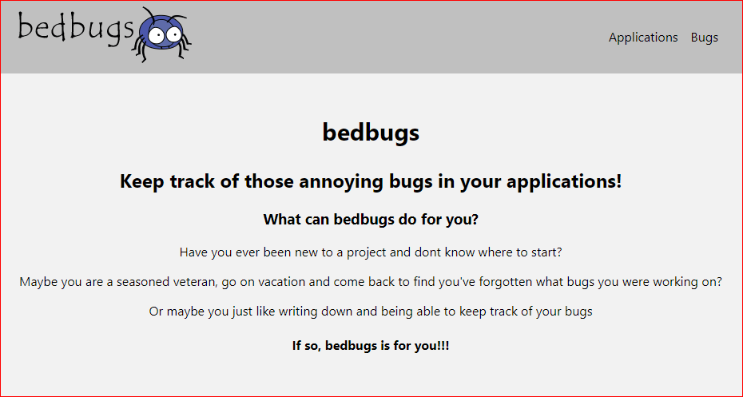
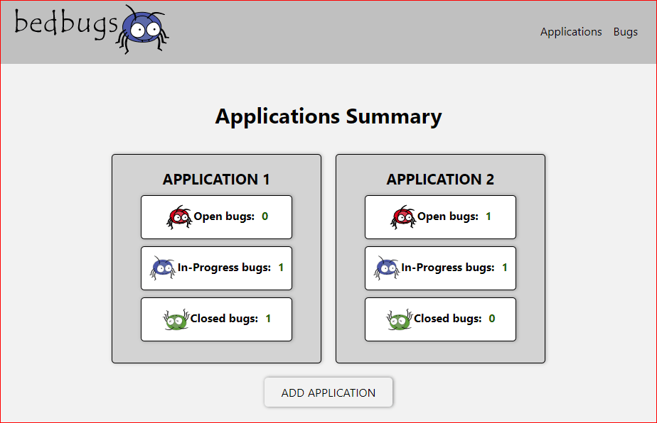
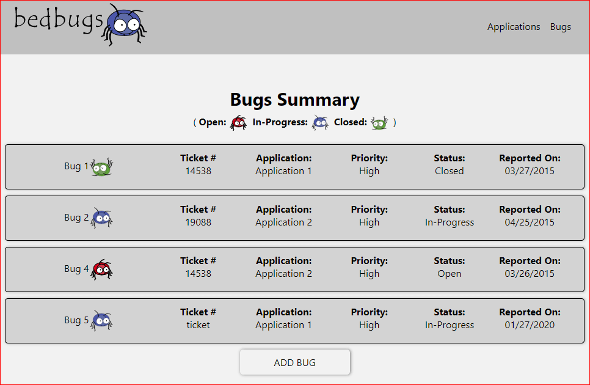

# bedbugs 

## What can bedbugs do for you?
Have you ever been new to a project and dont know where to start?

Maybe you are a seasoned veteran, go on vacation and come back to find you've forgotten what bugs you were working on?

Or maybe you just like writing down and being able to keep track of your bugs

If so, bedbugs is for you!!!

## Check it out
[https://bedbugs.now.sh](https://bedbugs.now.sh)

## Screenshots
#### Landing Page: [bedbugs.now.sh](https://bedbugs.now.sh)

#### Applications Summary: [bedbugs.now.sh/applications](https://bedbugs.now.sh/applications)
##### Get a List of the Applications and how many Bugs are either Open, In-Progress, or Closed.
Need to update your application?  Click on the Application Name and begin updating.  Be aware, Applications with open bugs cannot be deleted.

#### Bugs Summary:  [bedbugs.now.sh/bugs](https://bedbugs.now.sh/bugs)
##### Get a List of all the Bugs and their Ticket Number, Application, Priority, Status, and Who Reported the Bug
Need to update your bug?  Add some developer notes?  Click on the Bug Name and begin updating.

## Technology Used
HTML5, SCSS/CSS, Node.js, React, Express, PostgreSQL